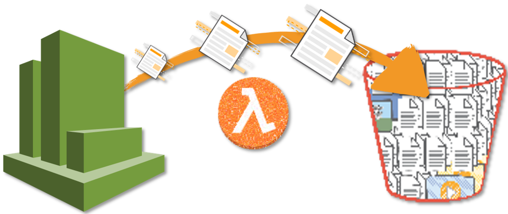
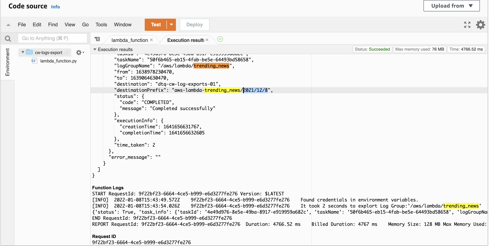
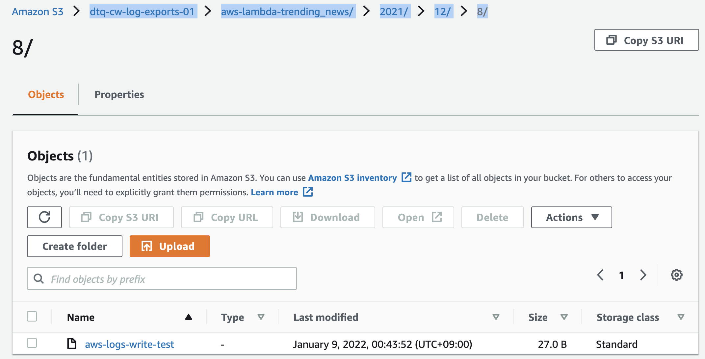

# Serverless Cloudwatch Logs To S3 Exporter


[](https://github.com/tquangdo/aws-lambda-export-cwatch-to-s3/issues/new)

AWS Serverless Lambda function that sends log data from CloudWatch Logs and S3.


## Follow this article in [Youtube](https://www.youtube.com/watch?v=JS0bDErJ9Rw&list=PLxzKY3wu0_FKok5gI1v4g4S-g-PLaW9YD&index=31&t=0s)

1. ## S3 Bucket Policy
    - create bucket `dtq-cw-log-exports-01`
    - To receive CloudWatch Logs exports the following `bucket policy` should be applied.

    ```json
    {
        "Version": "2012-10-17",
        "Statement": [
            {
                "Effect": "Allow",
                "Principal": {
                    "Service": "logs.us-east-1.amazonaws.com"
                },
                "Action": "s3:GetBucketAcl",
                "Resource": "arn:aws:s3:::dtq-cw-log-exports-01"
            },
            {
                "Effect": "Allow",
                "Principal": {
                    "Service": "logs.us-east-1.amazonaws.com"
                },
                "Action": "s3:PutObject",
                "Resource": "arn:aws:s3:::dtq-cw-log-exports-01/*",
                "Condition": {
                    "StringEquals": {
                        "s3:x-amz-acl": "bucket-owner-full-control"
                    }
                }
            }
        ]
    }
    ```

1. ## Lambda IAM role
    - create IAM role `serverless-cw-to-s3-exporter-role`
    - Create a new IAM Policy `ListBucketPolicy` with the following  configuration. _If you want, restrict it only to the buckets of your interests, in resources section_.
    **A policy to allow the script to verify valid S3 buckets**

    ```json
    {
        "Version": "2012-10-17",
        "Statement": [
            {
                "Effect": "Allow",
                "Action": [
                    "s3:ListBucket"
                ],
                "Resource": "*"
            }
        ]
    }
    ```

1. ## ⚙️ Configure Lambda Function - `cw-logs-export`
    - Provide the function name & choose `Python 3.7`
    - Attach the IAM Role - `serverless-cw-to-s3-exporter-role`
    - basic settings > timeout=`1min30sec`
    - copy paste code from `serverless-cloudwatch-logs-exporter.py`

    ```py
    global_vars["retention_days"]           = 30 # 1 months ago from now
    global_vars["cw_logs_to_export"]        = ["/aws/lambda/trending_news"]
    ```

1. ## cloudwatch
    - create log group name=`/aws/lambda/trending_news`

1. ## run lambda
    - will see OK results in `Test`
    
    - will see result of exporting to bucket `dtq-cw-log-exports-01`: `/aws/lambda/trending_news/2021/12/8/`
    